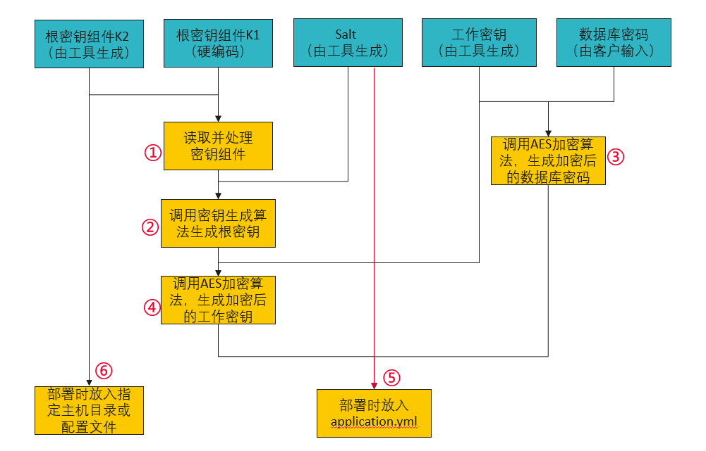

# xDM-F配置加解密使用手册

## 一、简介

本文档指导您如何根据既定的敏感信息加密方案完成配置自动解密开发。

您可以使用工业数字模型驱动引擎（Industrial Digital Model Engine，简称iDME）提供的敏感信息加密方案，也可以使用您的敏感信息加密方案。

决定好敏感信息加密方案后，请按照[三、程序运行时自动解密步骤](#三程序运行时自动解密)完成自动解密开发。

## 二、敏感信息加密方案

### 2.1 方案描述

增加一个加密工具，加密工具提供敏感信息加密能力。

部署阶段，加密工具提供生成安全随机数和对称加密功能，您通过加密工具生成根密钥组件和工作密钥，加密您的数据库密码。程序运行阶段，数据建模引擎运行SDK使用根密钥组件生成根密钥、使用解密算法对数据库密码进行解密。密钥整体采用两层密钥结构设计，根密钥和工作密钥，根密钥为工作密钥提供加密保护，工作密钥对数据提供加密保护。

### 2.2 部署阶段

密钥初始化：使用安全的随机数发生器生成根密钥组件K2（256bit及以上）、Salt（128bit及以上）、工作密钥（256bit）

1. 将全部的密钥组件收集起来，将密钥组件依次异或；
2. 调用根密钥生成算法，PKBDF2；

    DK = PKBDF2(HashAlg, K1 XOR K2, Salt, count, dkLen)

    PBKDF2 : 密钥派生函数名

    输入：

        HashAlg   : 哈希算法，推荐SHA256
        K1 XOR K2 : 根密钥组件经过异或处理
        Salt      : 盐值，为安全随机数，128bit
        count     : 迭代次数，正整数，1000次
        dkLen     : 派生密钥的字节长度，256bit

    输出：
        
        DK        : 派生的密钥，长度为dkLen个字节的字符串
3. 使用明文的工作密钥，调用AES-GCM-256算法对数据库密码加密；
4. 使用2生成的根密钥，对工作密钥进行加密；
5. 将Salt、密文的数据库密码和密文的工作密钥配置在配置文件；
6. 将根密钥组件K2配置在指定主机目录或其他配置文件。



### 2.3 程序运行阶段

1. 从代码及配置文件中读取所有密钥材料，并作异或处理；
2. 调用根密钥生成算法，PKBDF2；

   DK = PKBDF2(HashAlg, K1 XOR K2, Salt, count, dkLen)

   PBKDF2 : 密钥派生函数名

   输入：

        HashAlg   : 哈希算法，推荐SHA256
        K1 XOR K2 : 根密钥组件经过异或处理
        Salt      : 盐值，为安全随机数，128bit
        count     : 迭代次数，正整数，1000次
        dkLen     : 派生密钥的字节长度，256bit

   输出：

        DK        : 派生的密钥，长度为dkLen个字节的字符串
3. 从配置文件中读取工作密钥密文，调用AES-GCM-256解密算法，解密出工作密钥明文；
4. 从配置文件中读取数据库密码密文，调用AES-GCM-256解密算法，解密出数据库密码明文。


## 三、程序运行时自动解密

启动程序时，自动解密配置文件中的加密配置项。

下面将以Base64加解密作为示例，帮助您完成程序运行时自动解密开发工作。

1. 将加密后的配置项配置在配置文件中；

   配置文件(application.properties)示例：
   ```properties
   # 数据库密码（此处配置值经过部署阶段加密）。(XdmNeedDec)是解密前缀，标识该配置项需要解密，客户按需配置自己的解密前缀。
   RDS_PASSWORD=(XdmNeedDec)MTIzNDU2
   ```
2. 自定义MyCryptoTool类实现com.huawei.xdm.security.tool.IEncryptTool；

   xDM-F自定义MyCryptoTool示例：
   ```java
   package com.huawei.it.crypt;
   
   import com.huawei.xdm.security.tool.IEncryptTool;
   
   import lombok.extern.slf4j.Slf4j;
   
   import org.apache.commons.lang3.StringUtils;
   import org.springframework.core.Ordered;
   
   import java.nio.charset.StandardCharsets;
   import java.util.Base64;
   
   @Slf4j
   public class MyCryptoTool implements IEncryptTool {
      // 解密前缀。用户按需配置，需要和配置文件中解密前缀保持一致。
      private static final String NEED_DEC_FLAG = "(XdmNeedDec)";
   
      /**
       * 加密工具优先级。xDM-F的加密工具类优先级最低，用户需要确保MyCryptoTool的加密工具优先级高于xDM-F的加密工具。一般设置成(Ordered.LOWEST_PRECEDENCE-1)即可。
       * 
       * @return 加密工具优先级
       */
      @Override
      public int getOrder() {
         return Ordered.LOWEST_PRECEDENCE - 1;
      }
   
      /**
       * 获取解密前缀。
       * 
       * @return 解密前缀
       */
      @Override
      public String getNeedDecryptPrefix() {
         return NEED_DEC_FLAG;
      }
   
      /**
       * 加密。返回空字符串即可。
       * 
       * @param plainText 明文
       * @return 密文
       */
      @Override
      public String encrypt(String plainText) {
         return "";
      }
   
      /**
       * 带解密前缀的加密。返回空字符串即可。
       * 
       * @param plainText 明文
       * @return 带解密前缀的密文
       */
      @Override
      public String encryptWithPrefix(String plainText) {
         return "";
      }
   
      /**
       * 解密，xDM-F以Base64解密作为示例。用户的解密方案在此处实现。
       * 
       * @param cipherText 密文
       * @return 明文
       */
      @Override
      public String decrypt(String cipherText) {
         if (StringUtils.isEmpty(cipherText)) {
            return cipherText;
         }
         byte[] decode = Base64.getDecoder().decode(cipherText.getBytes(StandardCharsets.UTF_8));
         return new String(decode, StandardCharsets.UTF_8);
      }
   
      /**
       * 控制加载的配置项。此处必须设置成true，否则MyCryptoTool不生效。
       * 
       * @param configKey 控制加载的配置项
       * @return 是否加载
       */
      @Override
      public boolean needLoad(String configKey) {
         return true;
      }
   }
   ```
3. 在`resources`目录下创建文件`/META-INF/services/com.huawei.xdm.security.tool.IEncryptTool`，文件内容是自定义MyCryptoTool的全路径类名。

   SPI配置示例：
   ```text
   com.huawei.it.crypt.MyCryptoTool
   ```
4. 整体结构

   ```text
   项目结构
   ├── src
   │   ├── main
   │   │   ├── java
   │   │   │   └── com
   |   |   |   |   └── huawei
   |   |   |   |   |   ├── it
   |   |   |   |   |   |   └── crypt
   |   |   |   |   |   |   |   └── MyCryptoTool
   |   |   |   |   |   └── xdm
   |   |   |   |   |   |   └── demo02
   |   |   |   |   |   |   |   └── Demo02Application
   │   │   └── resources
   │   │   │   ├── META-INF
   |   |   |   |   └── services
   |   |   |   |   |   └── com.huawei.xdm.security.tool.IEncryptTool
   |   |   |   ├── application-sdk.properties
   |   |   |   └── license.dat
   └── lib
   |   └── xDM-F的SDK依赖包
   ```