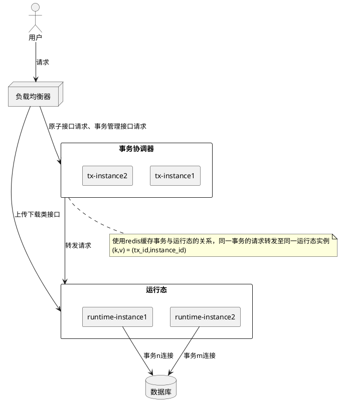

# xDM-F事务协调器部署手册

## 一、简介

xdm新增v3版本事务能力，可以通过相关功能实现多API调用在同一事务中进行处理，每个API调用能及时获取到中间状态。

为了将同一事务的所有请求转发到同一个运行态实例，新增本事务协调器组件。详细可参考v3事务实现方式。

## 二、部署

### 2.1 服务资源

资源清单：

- `xdm-tx-distributor.jar`：事务协调器部署包
- `README-tx-distributor.md`：本说明文档

建议最低部署机器规格：

| CPU | 内存    | 实例数 |
|-----|-------|-----|
| 1核+ | 2GiB+ | 2+  |

### 2.2 服务配置

该组件依赖服务发现能力，用于发现运行态部署的地址及端口，内置CCE、Kubernetes、静态配置等支持

配置文件（application.properties）示例：

```properties
######## 基础配置项 ########
# 当前组件端口，服务访问端口
server.port=6001
# 运行态对应的服务名
SERVICE_NAME=${APP_NAME}
# 应用id
APP_ID=${APP_ID}
# redis 地址
REDIS_HOST=127.0.0.1
# redis 端口
REDIS_PORT=6379
# ENC(jasypt加密后的密文) # redis 密码
REDIS_PASSWORD=
# jasypt秘钥
jasypt.encryptor.password=

######## 单机部署 ########
xdm.tx-distributor.discovery-type=static
# 运行态是否是https
xdm.tx-distributor.static.instance-secure=false
# 运行态地址，逗号分割
xdm.tx-distributor.static.instances=127.0.0.1:8003,127.0.0.1:8004

######## 使用CCE部署 ########
#xdm.tx-distributor.discovery-type=cce
## CCE服务对应集群的endpoint
#CCE_END_POINT=
## 项目id
#PROJECT_ID=
## iam服务的endpoint
#IAM_ENDPOINT=
## access key
#RES_AK=
## secret key
#RES_SK= 

######## 使用K8S部署 ########
#xdm.tx-distributor.discovery-type=k8s
## kubernate apiserver 地址
#API_SERVER_ENDPOINT=https://127.0.0.1:5443 
## base64编码的ca证书数据
#K8S_CA_CERT_DATA=
## base64编码的客户端证书数据
#K8S_CLIENT_CERT_DATA=
## base64编码的客户端私钥数据
#K8S_CLIENT_KEY_DATA= 
```

说明：

- 所有场景均需要的配置项，支持敏感信息使用jasypt加密
- 单机部署场景，支持配置固定地址，需要指定实际的运行态访问ip及端口，不能为经过负载均衡后的地址
- CCE部署场景，需要配置cce集群的endpoint，需要提供鉴权相关信息AK/SK/PROJECT_ID及iam服务的endpoint
- K8S客户端部署场景，支持通过k8s客户端证书认证方式，需要指定k8s部署集群的api server地址及相关证书，证书获取可参考第3节

### 2.3 容器化部署

1、Dockerfile模板参考

```dockerfile
# 使用基础镜像
FROM registry-cbu.huawei.com/fuxi-gate/centos7:base
# 准备资源：jar包、配置文件
COPY ./xdm-tx-distributor.jar /opt/cloud/xdm-tx-distributor.jar
COPY ./application.properties /opt/cloud/application.properties

# 设置工作目录
WORKDIR /opt/cloud/
# 挂载工作目录
VOLUME /opt/cloud/

# 启动数据建模引擎事务协调器SDK服务
CMD ["java", \
    "--add-opens","java.base/sun.security.util=ALL-UNNAMED", \
    "--add-opens","java.base/sun.security.x509=ALL-UNNAMED", \
    "--add-opens","java.base/sun.security.pkcs=ALL-UNNAMED", \
    "-jar","xdm-tx-distributor.jar"]
```

2、执行构建命令

```shell
docker build -t xdm-tx-distributor:1.0.0 .
```

3、启动命令参考

```shell
docker run -d -v /root/idme/xdm-tx-distributor/:/opt/cloud/ -p 6001:6001 xdm-tx-distributor:1.0.0
```


#### 2.4 K8s场景使用无头服务进行服务发现

1、增加headless服务配置

在K8s里使用yaml的方式直接创建 `headless`服务
配置修改点
- ${容器暴露出来的端口}
- ${服务的端口}
- ${工作负载的名称}
- ${无头服务的名称，建议为 工作负载名称-headless-service}
- namespace， 按服务所在的命名空间配置

```yml
metadata:
  name: ${无头服务的名称}
  namespace: default
  labels:
    app: ${工作负载的名称}
spec:
  ports:
    - name: cce-service-1
      protocol: TCP
      port: ${容器暴露出来的端口}
      targetPort: ${服务的端口}
  selector:
    app: ${工作负载的名称}
  clusterIP: None
status:
  loadBalancer: {}
apiVersion: v1
kind: Service
```

2、修改`TX`的配置，使用DNS解析获取实例的IP

```env
xdm.tx-distributor.discovery-type=dns-lookup
xdm.tx-distributor.static.instance-secure=false
xdm.tx-distributor.dns-lookup.serviceDomain=${无头服务的名称}.${命名空间}.svc.cluster.local
xdm.tx-distributor.dns-lookup.servicePort=${容器暴露出来的端口}
```


#### 2.5 其他服务发现能力

如果使用了其他服务发现能力，如 Nacos、ZooKeeper等，可自行接入，参考步骤：

1) 实现com.huawei.it.xdm.distributor.client.InstanceDiscoveryClient接口（可从部署包找到），从注册中心获取运行态的信息
2) 使用springboot自动装配机制，将实现的服务发现客户端bean注入容器中
3) 指定自己的服务发现类型xdm.tx-distributor.discovery-type

```java
/**
 * 服务发现客户端接口
 */
public interface InstanceDiscoveryClient {
    /**
     * 注册服务监听
     *
     * @param serviceId 服务id
     * @implNote 用于在事务协调器启动时注册监听回调，能在运行态服务发送变动时及时通知事务协调器
     */
    void watchInstances(String serviceId);

    /**
     * 获取服务实例
     *
     * @param serviceId 服务id
     * @return 实例
     * @implNote 获取对应服务的实例，接口不要返回null，ServiceInstance.instanceId不要重复，可缓存实例信息
     */
    @NotNull
    List<ServiceInstance> getInstances(String serviceId);

    /**
     * 失效现有实例列表，重新获取实例
     *
     * @param serviceId 服务id
     * @implNote 失效缓存的实例信息
     */
    void invalidate(String serviceId);

    /**
     * 关闭连接，清理资源
     */
    void shutdown();
}
```

## 参考

### k8s客户端证书获取

获取Kubernetes集群的客户端证书通常涉及检查配置文件、访问节点或生成新证书。

以下是常见方式：

> 方式 1：检查kubeconfig文件
> 
> 定位kubeconfig文件：
> 
> 默认路径：~/.kube/config
> 使用命令：ls -la ~/.kube/config
> 查看文件内容：
> 
> 使用文本编辑器（如vim、nano）或命令行工具（如cat、less）查看文件。
> 搜索clusters部分，查找certificate-authority-data字段，这包含CA证书的base64编码。
> 提取CA证书：
> 
> 将certificate-authority-data的值保存到文件，例如ca.crt：
> echo $(kubectl config view --raw --minify --output 'jsonpath={.clusters[].cluster.certificate-authority-data}') | base64 -d > ca.crt
> 提取客户端证书和私钥（如果存在）：
> 
> 搜索users部分，查找client-certificate-data和client-key-data。
> 提取并解码：
> echo $(kubectl config view --raw --minify --output 'jsonpath={.users[].user.client-certificate-data}') | base64 -d > client.crt
> echo $(kubectl config view --raw --minify --output 'jsonpath={.users[].user.client-key-data}') | base64 -d > client.key
> 
> 方式 2：访问Kubernetes Master节点
> 登录到Master节点：
> 
> 使用SSH或其他安全方式登录。
> 查找证书目录：
> 
> 通常位于/etc/kubernetes/pki/。
> 列出目录内容：ls /etc/kubernetes/pki/
> 复制证书：
> 
> 复制ca.crt、client.crt和client.key到本地：
> scp user@master:/etc/kubernetes/pki/ca.crt .
> scp user@master:/etc/kubernetes/pki/client.crt .
> scp user@master:/etc/kubernetes/pki/client.key .
> 
> 方式 3：使用kubeadm生成证书（如果需要）
> 初始化集群时生成证书：
> 
> 使用kubeadm init时，证书会生成在/etc/kubernetes/pki/。
> 提取证书：
> 
> 从上述目录复制所需的证书文件。
> 
> 方式 4：处理云服务提供商的集群
> 参考云提供商文档：
> 
> AWS EKS：使用aws eks describe-cluster获取证书。
> Azure AKS：通过Azure CLI获取。
> GCP GKE：使用gcloud工具。
> 使用特定工具下载证书：
> 
> 例如，EKS可能需要从集群描述中提取CA证书。

通过如上步骤获取到如下文件:

- ca.crt
- client.crt
- client.key

将上述文件进行base64编码，并合并成一行即可作为环境变量，建议对证书进行加密
```bash
base64 ca.crt | tr -d '\n'
```

- ca.crt      --> K8S_CA_CERT_DATA
- client.crt  --> K8S_CLIENT_CERT_DATA
- client.key  --> K8S_CLIENT_KEY_DATA

### 启动命令

该事务协调器使用jdk17进行编译，需要在java 17运行，使用如下命令启动。

```bash
# 准备配置文件，application.properties，并按需配置
touch application.properties
# 启动
$JAVA_HOME/bin/java --add-opens java.base/sun.security.util=ALL-UNNAMED \
  --add-opens java.base/sun.security.x509=ALL-UNNAMED \
  --add-opens java.base/sun.security.pkcs=ALL-UNNAMED \
  -jar xdm-tx-distributor.jar
```

### v3事务实现方式

通过保持数据库连接，并将所有同事务请求转发到同一个运行态使用同一个数据库连接来实现强事务。
事务的隔离级别为所用数据库默认的隔离级别，事务默认50秒超时。部署架构大体如下：



注意：在事务协调器资源有限的情况下，建议在负载均衡器将涉及大流量传输的接口直接转发给运行态。请一并改用预签名URL上传下载方式进行文件的上传下载（具体可参考云服务文档）。

已知接口清单如下(以指定路径结尾的请求)：

```ini
/rdm/basic/api/file/downloadFile
/rdm/basic/api/ResourceManagement/downloadFile
/rdm/basic/api/instanceUpload/uploadInstance
/rdm/basic/api/file/exportInstanceDataByIds
/rdm/basic/api/swagger/downloadFile
/rdm/basic/api/unitTypeUpload/uploadUnitType
/rdm/basic/api/UnitMeasuringExport/exportUnitData
/sync/offlineSynController/exportOfflineData
/offline/sync/import
/rdm/basic/api/file-extension/export
/rdm/basic/api/file-extension/import
/rdm/basic/api/UnitMeasuringExport/downloadTemplateXml
/sync/syncTenantController/downloadFile
/rdm/basic/api/upload/uploadFile
/rdm/basic/api/upload/uploadLargeFile
```
